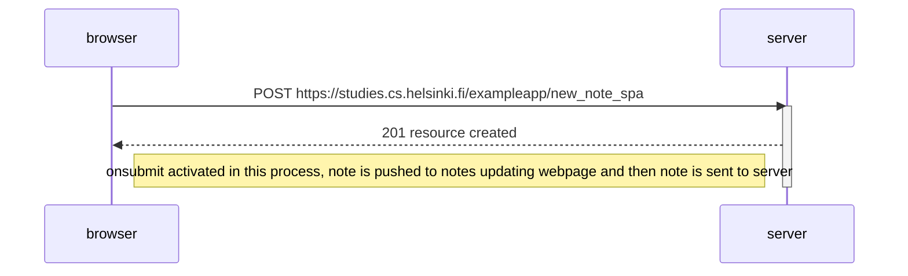

```mermaid
sequenceDiagram
participant browser
participant server

browser->>server: POST https://studies.cs.helsinki.fi/exampleapp/new_note_spa
activate server
server-->>browser: 201 resource created
Note right of browser: onsubmit activated in this process, note is pushed to notes updating webpage and then note is sent to server
deactivate server
```